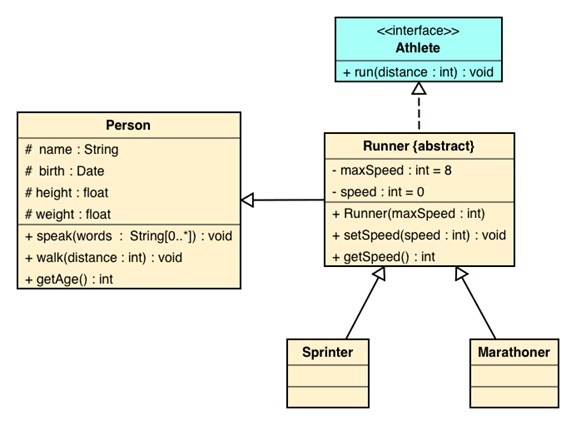

sproutloud
==========

SproutLoud Dev Test

Using a programming language of your choice, please complete the following tasks:

1. Write the source code for this UML diagram (do not implement methods)
2. Implement a default constructor for class Person, the constructor should set default values for all the class properties.
3. For class Person implement the method speak, this method should output to the console all the words concatenated and separated by a white space.
4. A Sprinter reduces his speed 15% for every meter he has run, once his speed is 50% of the max speed he must stop to prevent lesions. Write the code for the run method to reflect this.
5. A Marathoner likes to speak while he runs. For every mile he has run, he speaks the mile number, but for multiples of three he speaks 'Go' instead of the mile number, but for multiples of three he speaks 'Go' instead of the mile number and for multiple of five he speaks 'Faster'. For miles that are multiple of both he speaks 'Go Faster'.

